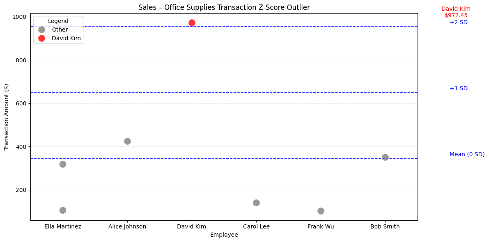

📊 SMART EXPENSE INSIGHTS: DETECTING OUTLIERS, POLICY FLAGS & BENCHMARK DEVIATIONS IN A SMALL COMPANY BUDGET

⸻

📌 Executive Summary

This project analyzes expense data for a small tech firm to detect fairness issues, policy violations, and unusual spending patterns. It combines company-wide benchmarking with a deep dive into the Sales department’s Office Supplies spend — surfacing red flags through z-score analysis, visual storytelling, and custom business logic. Broader scripts in the /exploration/ folder reflect a full-company view, while the finalized focus area shows how to drive actionable insights in one targeted domain.

⸻

👤 Example Company Description

The company is a small, specialized tech and professional services firm run by a lean team of six core employees. This tight-knit group handles custom software development, IT support, marketing campaigns, sales operations, and HR tasks for a range of clients across industries.

Because the company is small and agile, each employee wears multiple hats — working across departments to manage different projects, budgets, and client needs. As a result, all six employees are expected to share spending responsibilities equally — meaning their expenses should generally be balanced across departments and categories.

The organization maintains clear expense policies to keep spending in check while balancing remote and in-office work, plus regular travel for client meetings, conferences, and training.

⸻

💼 Business Scenario: Expense Review for Finance

You’re the sole data analyst supporting this small team. The finance lead has asked you to analyze the company’s expense records from the past year to spot early red flags, policy violations, or cost-saving opportunities.

You’ve been given a raw expense file that includes details like date, department, category, employee, vendor, and amount — all linked back to the same six employees who spend across every department.

Your goal is to turn this data into clear, actionable insights that help the team spend wisely and stick to budget as they grow — while flagging any spending patterns that look significantly above or below the fair share expected for each employee.

⸻

📋 Expense Policy Reference

| **Category**       | **Policy Rule**                                                                 |
|--------------------|----------------------------------------------------------------------------------|
| **Travel**         | Max **$855** per day per employee                                               |
| **Meals**          | Max **$55** per meal per employee                                               |
| **Office Supplies**| Any transaction over **$650** requires approval                                 |
| **Training**       | Max **$1,400** per employee per training/course                                 |
| **Software**       | Any new software purchase over **$2,000** must be procurement-approved          |

⸻

📁 Data Source – SmallCompany.csv

📝 Note: All expense data is fictional and designed for educational analysis only.

This file contains 100 rows of fictional expense data from the small, specialized tech and professional services firm. Each row represents an individual transaction made by one of six core employees across various departments and categories.

🔍 Columns:
    •    id – Unique transaction ID
    •    date – Purchase date (MM/DD/YY format)
    •    department – Department responsible for the spend (e.g., Sales, IT, Marketing)
    •    vendor – The company or service where the expense occurred
    •    employee – The individual who made the purchase
    •    category – Type of expense (e.g., Travel, Software, Office Supplies)
    •    amount – Transaction amount in USD

🧾 Purpose:

This file serves as the raw input for all analysis in this project. It was designed to mimic realistic company spending behavior, including:
    •    Overlapping responsibilities across employees and departments
    •    Diverse vendor usage
    •    A variety of expense types

⸻

📊 Benchmarking Logic Explained

To help identify which department-category pairs might warrant deeper investigation, I built a custom benchmarking system. This system scores each department based on how closely its spending aligns with expectations.

✅ Step-by-Step Logic
    1.    % of Department Spend by Category
Percent = (Category Spend / Total Dept Spend) × 100
This gives a normalized view of each department’s spending priorities.
    2.    Deviation from Category Average
Deviation = (This Dept’s % Spend) – (Category Average % Spend)
This tells us how unusually high or low a department is spending in each area.
    3.    Tier Midpoints from Percentiles
I split all deviation values into percentile-based tiers:
    •    Bottom 33% → Low
    •    Middle 33% → Medium
    •    Top 33% → High
In-between midpoints:
    •    Medium–Low = avg of Low and Medium
    •    Medium–High = avg of Medium and High
    4.    Manual Tier Expectations
Based on business context, I manually defined expected tier behavior for each department/category pair.
   📌 Note: Full expected tier assignments (e.g., Sales = Low on Office Supplies, High on Travel) are shown in the code for transparency. These were based on common sense assumptions for a small team with shared spending responsibilities.
    5.    Deviation from Expected Benchmark
Final Score = Actual Deviation – Expected Tier Midpoint
This reflects how far each department is from where they should be.

🎯 Why It Matters

This approach doesn’t just highlight high or low spenders — it shows where departments are behaving differently than expected.

The resulting heatmap offers:
    •    ✅ Targeted Diagnosis: Flag potential problem areas.
    •    📊 Executive Overview: Give leadership a clean snapshot of department behavior.

⸻

🧾 Sales Department – Office Supplies Deep Dive

This section investigates how the Sales department spends on Office Supplies, breaking down activity by employee, vendor, timing, and transaction detail.

The goal is to surface potential fairness issues, policy concerns, or unusual patterns that wouldn’t be obvious from totals alone. To do this, we apply a targeted workflow that:

Using a custom analysis workflow, we:
    •    Identify employees or vendors with unusually high spending using z-score thresholds
    •    Track monthly spending trends to spot seasonal spikes or irregular activity
    •    Flag any purchases made on weekends or U.S. holidays
    •    Visualize spending concentration by employee, individual transaction and vendor
    •    Highlight transaction-level outliers to uncover red flags

This approach helps surface potential fairness issues, policy concerns, or unusual patterns that wouldn’t be obvious from totals alone.

⸻

🧾 Office Supplies Logic Explained

To execute the analysis, we followed a structured process designed to flag outliers and spot anomalies across multiple dimensions.

✅ Step-by-Step Logic
    1.    Targeted Subset
Focus on Sales department’s Office Supplies transactions.
    2.    Employee-Level Analysis
Sum each employee’s Office Supplies spend, flag z-scores > 1.0.
    3.    Vendor-Level Analysis
Same logic applied to vendors, flag z-scores > 1.5.
    4.    Monthly Spend Trends
Group spend by month to identify spikes or seasonality.
    5.    Transaction-Level Outliers
Calculate z-score per transaction, flag z > 1.5.
   📌 Note: Z-score thresholds vary to avoid false positives.
    6.    Policy Checks (Weekends + Holidays)
Flag purchases made outside normal business days.
    7.    Employee % Share Bar Chart
Visualize how employee spend compares to even-split expectations.
    8.    Vendor Breakdown Pie Chart
Show how vendor usage is distributed.
    9.    Transaction Strip Plot
Show every transaction by employee — helpful to spot extreme values.

🎯 Why It Matters

By narrowing the lens to one department and category, this workflow enables the finance team to:
	•	Detect fairness or policy violations
	•	Identify vendor overuse or odd timing behavior
	•	Flag single transactions that skew totals disproportionately

This type of department-level investigation supports smarter audits, tighter controls, and cleaner, more transparent budgets.
⸻

📊 Final Visuals and Insights

  
📎 David Kim accounts for over 40% of total Office Supplies spend — flagged via z-score as a potential outlier, well above the expected average of ~16.7%.

This bar chart compares each employee’s share of total Office Supplies spending within the Sales department.
The red dashed line represents the expected even share if spending were split equally among all employees.
    •    Blue bars indicate within-normal-range spending.
    •    Orange bars mark employees whose spending was flagged as an outlier (z-score > 1.0 or < -1.0).

This view helps surface fairness issues and possible budget misuse that wouldn’t be clear from totals alone.

  
📎 Over 60% of all Office Supplies purchases in Sales went to Staples, suggesting a heavy vendor concentration.

This pie chart breaks down which vendors received Office Supplies spending from the Sales department.
    •    A dominant share went to Staples (60.6%), while Amazon and Office Depot split most of the remaining spend.
    •    A smaller portion (4.4%) went to Hilton — an unusual entry for this category.

This visualization helps highlight potential overreliance on specific vendors and raises questions about purchasing diversity or policy alignment.

  
📎 A single $972 transaction by David Kim stands out at over +2 standard deviations above the mean — flagged as a potential red flag based on z-score.

This chart shows all individual Office Supplies transactions in the Sales department, plotted by employee.
    •    Gray dots represent standard transactions.
    •    The red dot marks a transaction flagged as an outlier (z > 1.5).
    •    Blue dashed lines show the mean and key standard deviation thresholds for context.

This view helps uncover isolated spikes in spending that wouldn’t be caught through total summaries — offering a clear lens on potential misuse or exception-based activity.

  
📎 This heatmap shows how far each department’s category-level spend deviates from its expected benchmark — highlighting major over- or under-spending areas.

Each cell represents a department’s deviation (in percentage points) from its expected category spending tier:
    •    🔴 Red cells indicate spending above expected levels.
    •    🔵 Blue cells indicate spending below expectations.
    •    ⚪ Neutral colors show spending roughly in line with expectations.

For example:
    •    Sales overspent on Office Supplies by +28.3 points compared to what was expected.
    •    Engineering underspent on Software by over 22 points.

This visual quickly surfaces policy misalignment, budget anomalies, or misprioritized resources that would be missed in raw totals or standard breakdowns.

⸻

📈 Key Insights
    •    ⚠️ Single Outlier Transaction: One $972 purchase = 40% of category spend
    •    👤 Employee-Level Imbalance: David Kim far above team average
    •    🏪 Vendor Concentration: Staples = 60% of spend, flagged as outlier
    •    📅 Timing Irregularities: Weekend + holiday purchases
    •    📊 Benchmark Deviation: Sales overspent Office Supplies by +28.3%
📦 Expense Analysis – Small Company Budget Review

⸻

🧭 Project Scope & Exploration

While the final deep dive focuses on Sales department Office Supplies, this project was designed to evaluate company-wide expense behavior.

The /exploration/ folder contains a broader set of scripts that:
	•	Flag policy violations across all departments
	•	Detect vendor concentration and same-day spend patterns
	•	Surface timing trends, category gaps, and monthly fluctuations

These exploratory scripts reflect my full analytical process. They extend the project beyond just Sales — showing how I approached company-wide risk, fairness, and policy alignment — even if only one segment was fully finalized due to time.

📁 See all supporting analysis in /exploration/ — these represent thoughtful extensions of the core project, not abandoned work.

⸻

🔍 Project Summary
	•	Department Focus (Finalized Deep Dive): Sales
	•	Category Analyzed (Finalized Deep Dive): Office Supplies
	•	Company-Wide Exploration Topics (in /exploration/):
 • Meals and Travel policy checks
 • Vendor concentration & repeat use
 • Same-day transaction detection
 • Monthly trend visualization
	•	Dataset: Internal transactions with fields date, id, employee, vendor, amount, category, department
	•	Tools Used: Python, Pandas, DuckDB, Seaborn, Matplotlib, Z-score analysis, Custom benchmarking
 
 ⸻

 📂 Repository Structure

project-folder/
│
├── charts/
│   ├── employee_spend.png
│   ├── vendor_breakdown.png
│   ├── transactions.png
│   └── category_tiers.png
│
├── data/
│   └── SmallCompany.csv
│
├── exploration/
│   ├── monthly_spend.py
│   ├── policy_checks.py
│   ├── sales_check.py
│   ├── same_day_vendor.py
│   └── vendor_concentration.py
│
├── scripts/
│   ├── category_benchmarks.py
│   └── sales_office_supplies.py
│
├── requirements.txt
└── README.md

 ⸻

🧠 Skills Demonstrated
    •    Real-world anomaly detection using z-scores
    •    Custom business benchmarking logic
    •    Transaction filtering and aggregation
    •    Visual storytelling with charts
    •    SQL-style querying with DuckDB in Python
    •    Clear, structured communication of insights

⸻

🎥 Loom Video

Watch the walk-through → (https://loom.com/your-link-here)

⸻

✍️ Author

Bryan H.
Aspiring Data Analyst focused on business intelligence, expense optimization, and operational insight.
