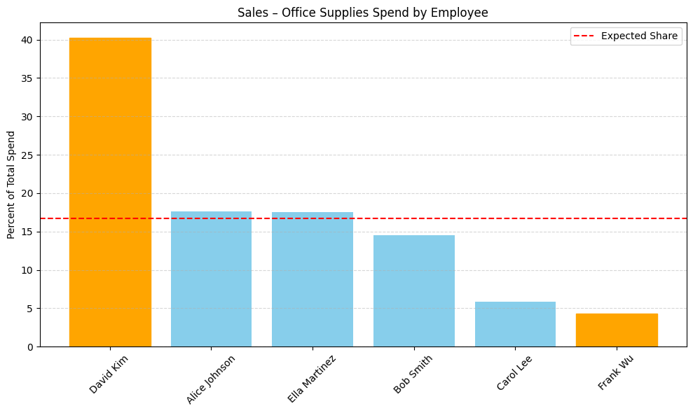
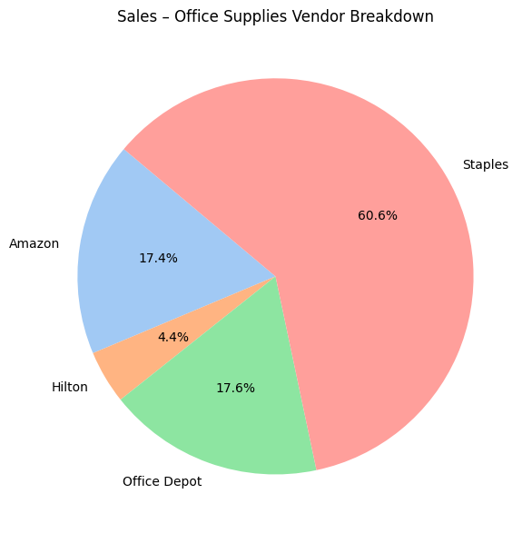
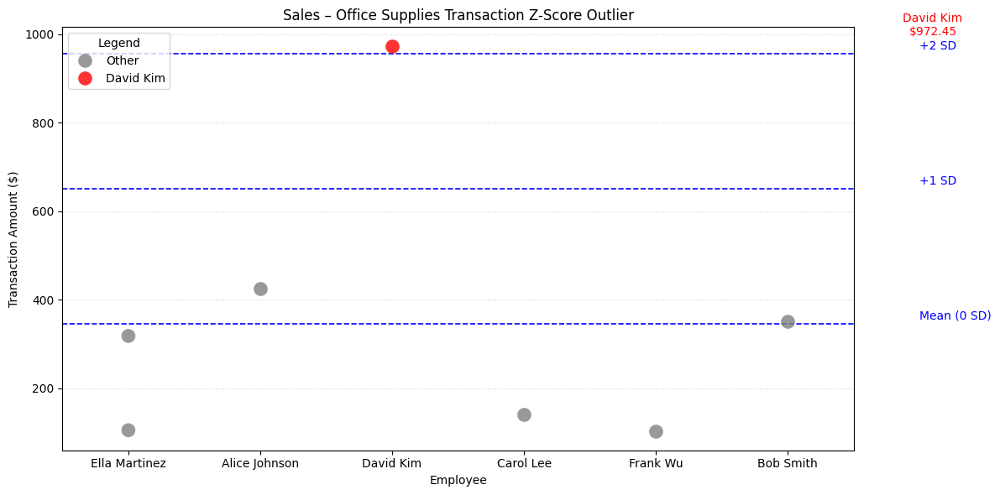
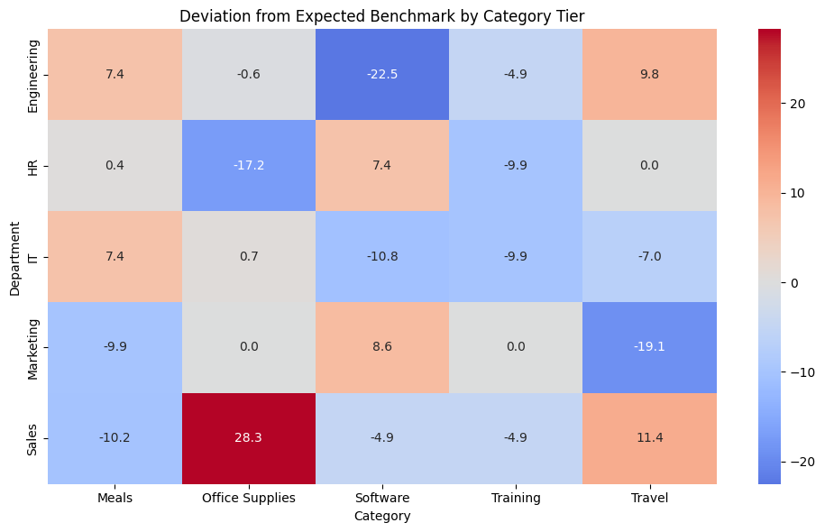

## 📊 Expense Insights & Risk Detection for a Small Tech & Services Firm 

---

### 📌 Executive Summary  
This project analyzes expense data for a small tech and professional services firm to uncover fairness concerns, policy violations, vendor risks, and unusual spending patterns.
It combines a company-wide benchmarking framework with a detailed analysis of the Sales department’s Office Supplies spending — surfacing red flags through z-score outlier detection, category-level benchmarking, and targeted visual analysis.
The /exploration/ folder contains additional scripts that extend this process to the entire company, while the finalized focus area demonstrates how the approach can deliver clear, actionable insights in a single high-priority domain.

---

### 👤 Example Company Description  
The company is a small, specialized tech and professional services firm run by a lean team of six core employees. This tight-knit group handles custom software development, IT support, marketing campaigns, sales operations, and HR tasks for a range of clients across industries.  

Because the company is small and agile, each employee wears multiple hats — working across departments to manage different projects, budgets, and client needs. As a result, all six employees are expected to share spending responsibilities equally — meaning their expenses should generally be balanced across departments and categories.  

The organization maintains clear expense policies to keep spending in check while balancing remote and in-office work, plus regular travel for client meetings, conferences, and training.  

---

### 💼 Business Scenario: Expense Review for Finance  
You’re the sole data analyst supporting this small team. The finance lead has asked you to analyze the company’s expense records from the past year to spot early red flags, policy violations, or cost-saving opportunities.  

You’ve been given a raw expense file that includes details like date, department, category, employee, vendor, and amount — all linked back to the same six employees who spend across every department.  

Your goal is to turn this data into clear, actionable insights that help the team spend wisely and stick to budget as they grow — while flagging any spending patterns that look significantly above or below the fair share expected for each employee.  

### 📋 Example Company's Expense Policy Reference

| **Category**        | **Policy Rule**                                                                 |
|---------------------|----------------------------------------------------------------------------------|
| **Travel**          | Max **$855** per day per employee                                               |
| **Meals**           | Max **$55** per meal per employee                                               |
| **Office Supplies** | Any transaction over **$650** requires approval                                 |
| **Training**        | Max **$1,400** per employee per training/course                                 |
| **Software**        | Any new software purchase over **$2,000** must be procurement-approved          |

---

### 📁 Data Source – `SmallCompany.csv`

📝 **Note:** All expense data is fictional and created for educational analysis only.

This file contains 100 rows of fictional expense data from the small, specialized tech and professional services firm. Each row represents an individual transaction made by one of six core employees across various departments and categories.

#### 🔍 Columns:
- **id** – Unique transaction ID  
- **date** – Purchase date (`MM/DD/YY` format)  
- **department** – Department responsible for the spend (e.g., Sales, IT, Marketing)  
- **vendor** – The company or service where the expense occurred  
- **employee** – The individual who made the purchase  
- **category** – Type of expense (e.g., Travel, Software, Office Supplies)  
- **amount** – Transaction amount in USD  

#### 🧾 Purpose:
This file serves as the raw input for all analysis in this project. It was designed to mimic realistic company spending behavior, including:

- Overlapping responsibilities across employees and departments  
- Diverse vendor usage  
- A variety of expense types

---

### 📊 Category-Level Benchmarking (All Departments)

Comparing each department’s spending behavior to what’s expected.

This section evaluates how each department’s spending behavior aligns with expectations across categories like Travel, Meals, Office Supplies, Training, and more.

To do this, I created a custom benchmarking system that:

- Calculates what % of each department’s budget goes to each category  
- Compares that to what’s typical across all departments  
- Defines expected spend levels (Low, Medium-Low, Medium, Medium-High, High) for each department and category  
- Visualizes how far off each department is from those expectations using a color-coded heatmap  

---

### ✅ Step-by-Step Benchmarking Process

**% of Department Spend by Category**  
Percent = (Category Spend / Total Dept Spend) × 100  
→ This gives a normalized view of each department’s spending priorities.

**Deviation from Category Average**  
Deviation = (This Dept’s % Spend) – (Category Average % Spend)  
→ This tells us how unusually high or low a department is spending in each area.

**Tier Midpoints from Percentiles**  
I split all deviation values into percentile-based tiers:  
- Bottom 33% → Low  
- Middle 33% → Medium  
- Top 33% → High  

In-between midpoints:  
- Medium–Low = average of Low and Medium  
- Medium–High = average of Medium and High  

**Manual Tier Expectations**  
Based on business context, I manually defined expected tier behavior for each department/category pair.  
📝 *Note: Full tier assignments are available in the code for transparency. These were based on common sense assumptions for a small team with shared spending responsibilities.*

**Deviation from Expected Benchmark**  
Final Score = Actual Deviation – Expected Tier Midpoint  
→ This reflects how far each department is from where they should be.

---

### 🎯 Why It Matters

This approach doesn’t just highlight high or low spenders — it shows where departments are behaving differently than expected.

The resulting heatmap offers:

- ✅ Targeted Diagnosis: Flag potential problem areas  
- 📊 Executive Overview: Give leadership a clean snapshot of department behavior

---

### 🧾 Sales Department Deep Dive – Office Supplies

Zooming in on how the Sales department spends on Office Supplies — by employee, vendor, timing, and transaction detail.

While the broader project explores company-wide behavior, this finalized deep dive focuses on a single department-category combo to surface red flags that wouldn’t be obvious from totals alone.

To do this, I built a focused workflow that:

- Flags employees or vendors with unusually high spend using z-scores  
- Tracks monthly spend trends to spot spikes or seasonal patterns  
- Detects purchases on weekends or U.S. holidays  
- Visualizes spending concentration by employee, vendor, and transaction  
- Highlights individual outliers for deeper investigation  

---

### ✅ Step-by-Step Analysis Workflow

**Targeted Subset**  
Focus only on Sales department’s Office Supplies transactions.

**Employee-Level Analysis**  
Sum each employee’s spend in this category.  
→ Flag z-scores > 1.0 to catch above-average behavior.

**Vendor-Level Analysis**  
Sum each vendor’s spend in this category.  
→ Flag z-scores > 1.5 to catch overreliance.

**Monthly Spend Trends**  
Group spending by month to detect seasonal or unusual spikes.

**Transaction-Level Outliers**  
Calculate z-scores for each individual transaction.  
→ Flag z > 1.5 to catch standout anomalies.  
📝 *Note: Z-score thresholds vary slightly to avoid false positives.*

**Timing Flags**  
Flag any purchases made on weekends or U.S. holidays.

**Employee % Share Chart**  
Show each employee’s % of total category spend.  
→ Compare against a fair split (≈16.7%) to spot imbalances.

**Vendor Breakdown Pie Chart**  
Visualize vendor concentration — who got the most business?

**Transaction Strip Plot**  
Show every transaction by employee to spot extremes or clusters.

---

### 🎯 Why It Matters

This department-level workflow enables the finance team to:

- ✅ Flag fairness concerns in how spending is distributed  
- ✅ Spot vendor overuse or unusual purchase timing  
- ✅ Identify transactions that significantly impact total spend

This supports smarter audits, tighter controls, and cleaner, more transparent budgets.

---

### 📊 Final Visuals and Insights

  
📎 **David Kim and Frank Wu were both flagged as outliers** in the Sales department’s Office Supplies spending based on z-scores.

This bar chart compares each employee’s share of total Office Supplies spending within the Sales department.  
The red dashed line represents the expected even share if spending were split equally among all employees (~16.7%).

- 🟠 **David Kim** had a z-score > **+1.0**, marking him as a high-end outlier 
- 🟠 **Frank Wu** had a z-score < **-1.0**, marking him as a low-end outlier  
- 🔵 Blue bars indicate spending within the normal range
- 🟠 Orange bars mark employees whose spending was flagged as an outlier (z-score > 1.0 or < -1.0)

This view helps surface fairness issues and possible budget misuse that wouldn’t be clear from totals alone.

---

  

📎 Over 60% of all Office Supplies purchases in Sales went to Staples — flagged as a potential outlier based on vendor z-score > 1.5.

This pie chart breaks down which vendors received Office Supplies spending from the Sales department:

- 🏪 Staples received a dominant 60.6% share, exceeding the 1.5 z-score threshold and suggesting possible overreliance.
- 📦 Amazon and Office Depot split most of the remaining spend in more typical proportions.
- ❓ Hilton received 4.4% of spend — an unusual vendor for Office Supplies.

This visualization helps highlight potential overreliance on specific vendors and raises questions about purchasing diversity or policy alignment.

---

  
📎 **A single $972 transaction by David Kim** stands out at over +2 standard deviations above the mean — flagged as a potential red flag based on z-score.

This chart shows all individual Office Supplies transactions in the Sales department, plotted by employee.

- ⚪ Gray dots represent standard transactions  
- 🔴 Red dot marks a transaction flagged as an outlier (z > 1.5)  
- 🔵 Blue dashed lines show the mean and standard deviation thresholds

This view helps uncover isolated spikes in spending that wouldn’t be caught through total summaries — offering a clear lens on potential misuse or exception-based activity.

---

  
📎 **This heatmap shows how far each department’s category-level spend deviates from its expected benchmark** — highlighting major over- or under-spending areas.

Each cell represents a department’s deviation (in percentage points) from its expected category spending tier.

- 🔴 Red cells indicate spending **above** expected levels  
- 🔵 Blue cells indicate spending **below** expectations  
- ⚪ Neutral colors show spending **in line** with expectations

For example:

- **Sales** spent **28.3 percentage points more** on Office Supplies than expected  
- **Engineering** spent **22 points less** than expected on Software

This visual quickly surfaces policy misalignment, budget anomalies, or misprioritized resources that would be missed in raw totals or standard breakdowns.

---

📈 Key Insights
    •    ⚠️ Single Outlier Transaction: One $972 purchase = 40% of category spend
    •    👤 Employee-Level Imbalance: David Kim far above team average
    •    🏪 Vendor Concentration: Staples = 60% of spend, flagged as outlier
    •    📅 Timing Irregularities: Weekend + holiday purchases
    •    📊 Benchmark Deviation: Sales overspent Office Supplies by +28.3%
📦 Expense Analysis – Small Company Budget Review

⸻

🧭 **Project Scope**  
This project was designed to address a real-world business goal:  

> “As the sole data analyst supporting a small team, my task was to analyze the company’s past-year expense records to surface fairness concerns, policy violations, vendor risks, cost-saving opportunities, and budget misalignment — and to deliver clear, visual insights that help leadership make smarter financial decisions as the company grows.”

To accomplish this, I built multiple scripts and analysis layers, but intentionally finalized and documented only two core pieces of the pipeline:  

---

### ✅ **Finalized Analyses in This README**

- **📊 Category Benchmark Heatmap**  
  Cross-department view of overspending/underspending vs. benchmark tiers.

- **🧾 Detailed Analysis: Sales – Office Supplies**  
  Investigation of one flagged department-category pair.

These two analyses are fully complete, visualized, and documented in this README — showcasing the end-to-end workflow I developed.  

---

### 🧪 **Exploratory Scripts (Not Finalized)**  

In addition to the two finalized outputs, I built and tested a range of company-wide supporting tools that reflect my full analytical process.  

These are housed in the `exploration.py` file and demonstrate how I approached the entire company. The scripts below show the breadth of my process and how I would scale this approach if completing the full audit:  

- 🚨 **Policy Violation Check**  
  Scans all transactions across the company and flags any that exceed category-specific spending limits.  

- 🧾 **Company-Wide Vendor Risk Analysis**  
  Analyzes how much spend flows to each vendor, flags over reliance and identifies single-use vendors.  

- 🔁 **Same-Day Vendor Repeats**  
  Checks for cases where an employee made multiple purchases from the same vendor on the same day — which could signal batching, duplicates, or policy issues.  

- 📈 **Monthly Spend Trends**  
  Groups total company expenses by month to visualize spending cycles, spot seasonal spikes, or highlight unusual surges.  

- 🔍 **Sales Department Category Scan**  
  Provides a quick summary of how the Sales team spent across all categories except Office Supplies (which was covered in a full detailed analysis). Flags all timing issues and outliers.

📝 **Note:** These exploratory scripts were not fully polished into final charts or visuals in the README, nor were they fully developed and documented like the finalized category heatmap and Sales Office Supplies analysis. However, they reflect the complete analytical workflow I would follow to scale this project — providing clear examples of how I would extend the process across all departments and any category flagged for review.  

These scripts helped me cover the full scope of my assigned goal and ensured I could identify issues across departments — even if they weren’t all polished for presentation.

📁 See all supporting analysis in /exploration/

---

### 📌 **What I’d Do If This Were a Full Audit**  

If I were continuing this analysis as part of a full audit, I would:  
- ✅ Conduct full, detailed analyses — like the Sales–Office Supplies example — for every department-category combination in the heatmap that shows a deviation large enough to warrant deeper investigation (e.g. +20% or –15% or more from benchmark expectations).  
- ✅ Create brief department overviews for each team (like I did for Sales) to summarize spending behavior across categories.  
- ✅ Finalize each company-wide script by converting it into a clear visual summary and polished, executive-ready output.  

---

### 🔍 **Project Summary**

- **Department Focus (Finalized Analysis):** Sales  
- **Category Analyzed (Finalized Analysis):** Office Supplies  

- **Company-Wide Explorations** *(in `/exploration/`)*:  
  - Policy violation checks  
  - Vendor concentration & single-use vendor identification  
  - Same-day vendor repeat detection  
  - Monthly spending trend visualization  
  - Sales department category scan (non–Office Supplies)  

- **Dataset:** Internal transactions including:  
  `date`, `department`, `category`, `employee`, `vendor`, `amount`  

- **Tools & Methods:**  
  Python • Pandas • DuckDB • Seaborn • Matplotlib • Z-score analysis • Custom category benchmarking

---

### 📂 Repository Structure
```plaintext
project-folder/
│
├── charts/
│   ├── employee_spend.png
│   ├── vendor_breakdown.png
│   ├── transactions.png
│   └── category_tiers.png
│
├── data/
│   └── SmallCompany.csv
│
├── exploration/
│   ├── monthly_spend.py
│   ├── policy_checks.py
│   ├── sales_check.py
│   ├── same_day_vendor.py
│   └── vendor_concentration.py
│
├── scripts/
│   ├── category_benchmarks.py
│   └── sales_office_supplies.py
│
├── requirements.txt
└── README.md
```

---

### 🧠 **Skills Demonstrated**

- Real-world anomaly detection using **z-scores**  
- Building **custom business benchmarking** logic for category comparisons  
- Filtering, grouping, and aggregating transaction data for insight discovery  
- **Visual storytelling** through clear, actionable charts  
- Using **DuckDB in Python** for fast, SQL-style querying  
- Communicating findings in a **clear, structured, and business-friendly** format

---

### 🎥 **Loom Video**  
Watch the walk-through → [https://loom.com/your-link-here](https://loom.com/your-link-here)  

---

### ✍️ **Author**  
**Bryan H.**  
Aspiring Data Analyst focused on business intelligence, expense optimization, and operational insight.  
